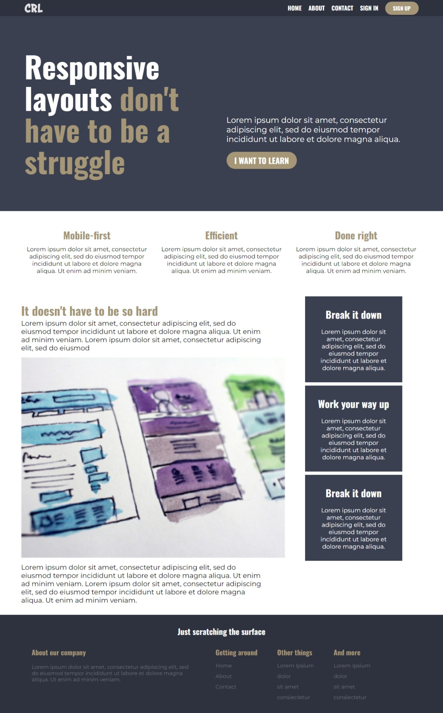

# Conquering Responsive Layouts - Final Navigation Challenge

This is a solution to the [Solution to Final 
Navigation Challenge on Kevin Powell's Conquering Responsive Layouts](https://courses.kevinpowell.co/view/courses/conquering-responsive-layouts). Conquering Responsive Layouts help you improve your CSS skills by building realistic projects. 

## Table of contents

- [Overview](#overview)
  - [The challenge](#the-challenge)
  - [Screenshot](#screenshot)
  - [Links](#links)
- [My process](#my-process)
  - [Built with](#built-with)
  - [What I learned](#what-i-learned)
  - [Useful resources](#useful-resources)
- [Author](#author)
- [Acknowledgments](#acknowledgments)

## Overview

### The challenge

Users should be able to:

- View the relevant dropdown menus on desktop and mobile when interacting with the navigation links
- View the optimal layout for the content depending on their device's screen size

### Screenshot

### Links

[Live site URL](https://i-strider243.github.io/conquering-responsive-layouts__final-nav-challenge/)

## My process

### Built with

- Semantic HTML5 markup
- CSS custom properties
- Flexbox
- Mobile-first workflow
- Javascript

### What I learned

I learnt how to make a responsive nav bar with a toggle button. I also learnt to use classes for styling. I further gained more knowledge on the various CSS Units e.g rem, em, and their use cases.

### Useful resources

- [Responsive navbar tutorial using HTML CSS & JS](https://youtu.be/HbBMp6yUXO0) - This helped me to make the toggle button responsive using Data Attribute, I really liked this pattern and will use it going forward.
- [How to detect on click outside div with javascript](https://www.codegrepper.com/code-examples/javascript/on+click+outside+div+javascript) - This is an amazing article which helped me finally understand how to detect a click outside an element. I'd recommend it to anyone still learning this concept.

## Author

- Website - [Add your name here](https://www.your-site.com)
- Frontend Mentor - [@i-Strider243] - (https://www.frontendmentor.io/profile/i-Strider243)
- Twitter - [@Strider18](https://twitter.com/Strider18)

## Acknowledgments

My solution was mostly inspired by the tutorial video "Responsive navbar tutorial using HTML CSS & JS" by Kevin Powell and all lessons learnt during the CRL course.
